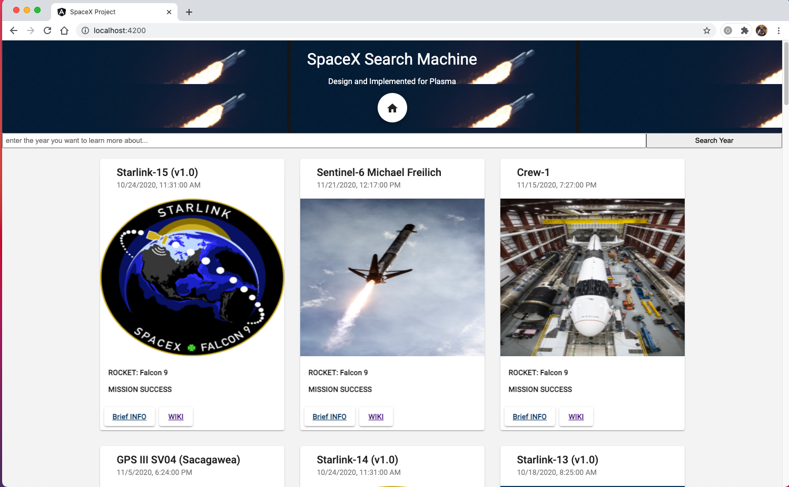

# SpaceX Angular-Apollo Project

## Project Goal

The project aims to to create a functional website with frontend using Angular to display data gathered from the public spacex graphql api. 

## Project DEMO




## Setup Instructions

1. Install necesseary configs in the project directory by

   ```bash
   npm install
   ```

   Make sure to delete the default template in `src/app/app.component.html`

1. Install the [Apollo VS Code plugin](https://marketplace.visualstudio.com/items?itemName=apollographql.vscode-apollo) and in the root of the project add `apollo.config.js`

   ```javascript
   module.exports = {
     client: {
       service: {
         name: 'angular-spacex-graphql-codegen',
         url: 'https://api.spacex.land/graphql/'
       }
     }
   };
   ```


2. Initiate the dev server with 

   ```bash
   ng serve
   ```

   Access the project's page from `http://localhost:4200/`, and it will work!

### Project Highlights

The project is built while satisfying all the requirements and higlights:

1. Lazy loading routes / lazy loading imgs.

2. Complete Git management process.

3. Full responsive to all devices.

